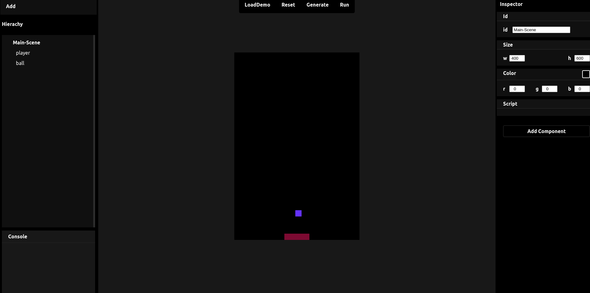
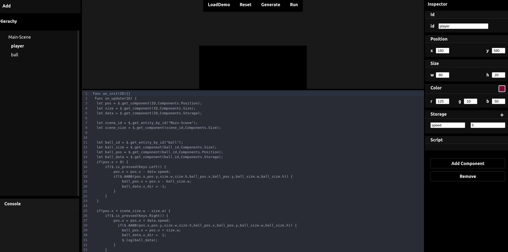
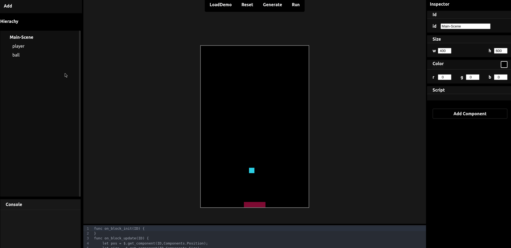

# Epic Editor
epic editor is a bare bones game engine that uses only rectangles.             
[old version](https://github.com/t-88/ta6bi9y)
    
the idea is that you create your game using the editor drag and drop / coding functionalities,when you finish your work you get to export it as a pygame project [epic.rs api](https://github.com/t-88/epic.rs).          
        

## Quick Start
- go to the website [epic-editor vercel](https://epic-editor.vercel.app/)
- load demo using the loadDemu button
- then run!
- to build the desktop version, click on generate, take the src.json and fellow [epic.rs](https://github.com/t-88/epic.rs) 

## Start Dev
- read the [docs](./lang.docs.md) of op lang, and you good to go 

## Preview

  
    
 

  
   
 

  
   
